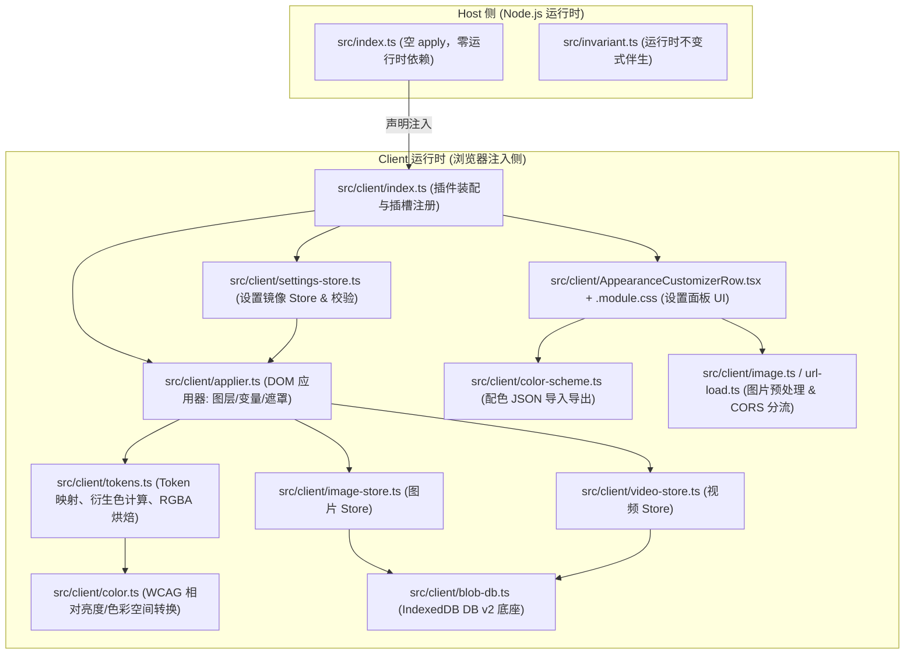

# dsh-ui-appearance 架构设计与技术知识库 (Knowledge Base)

本文档是 `dsh-ui-appearance`（DeepSeek Harness WebUI 外观定制插件）的**完整技术设计与知识库**，详细记录了插件的系统架构、色彩推导模型、Token 覆写引擎、半透明烘焙流水线、图形层叠与毛玻璃实现、IndexedDB 多媒体存储底座以及生态兼容策略。

---

## 目录

- [1. 核心设计原则与架构哲学](#1-核心设计原则与架构哲学)
- [2. 系统架构与模块拓扑](#2-系统架构与模块拓扑)
- [3. `--dsw-*` 语义 Token 覆写引擎与色彩系统](#3---dsw--语义-token-覆写引擎与色彩系统)
  - [3.1 核心颜色角色与 Token 映射](#31-核心颜色角色与-token-映射)
  - [3.2 双模式色彩衍生与混合算法](#32-双模式色彩衍生与混合算法)
  - [3.3 智能深浅翻转 (Dark-Flip)](#33-智能深浅翻转-dark-flip)
  - [3.4 WCAG 对比度感知反色算法 (onInk)](#34-wcag-对比度感知反色算法-onink)
- [4. 半透明烘焙与材质渲染系统](#4-半透明烘焙与材质渲染系统)
  - [4.1 为什么避免运行时 `color-mix` 与 `backdrop-filter`？](#41-为什么避免运行时-color-mix-与-backdrop-filter)
  - [4.2 静态 RGBA 烘焙流水线](#42-静态-rgba-烘焙流水线)
  - [4.3 强调字 (Markdown Inline Code) 与交互态保持](#43-强调字-markdown-inline-code-与交互态保持)
- [5. 图形图层与层叠上下文 (Stacking Context) 控制](#5-图形图层与层叠上下文-stacking-context-控制)
  - [5.1 固定背景图层 `#dsw-appearance-bg`](#51-固定背景图层-dsw-appearance-bg)
  - [5.2 为什么坚决不动 `#root`？(#10 架构复盘)](#52-为什么坚决不动-root-10-架构复盘)
  - [5.3 毛玻璃与宿主弹窗遮罩 (`--dsw-mask-blur`) 联动](#53-毛玻璃与宿主弹窗遮罩---dsw-mask-blur-联动)
- [6. 多媒体与持久化存储架构](#6-多媒体与持久化存储架构)
  - [6.1 存储分层模型：localStorage vs IndexedDB](#61-存储分层模型localstorage-vs-indexeddb)
  - [6.2 IndexedDB DB v2 底座设计](#62-indexeddb-db-v2-底座设计)
  - [6.3 图片无损预处理与超限等比缩边 (4096px)](#63-图片无损预处理与超限等比缩边-4096px)
  - [6.4 50MB 视频 Blob 引用存储](#64-50mb-视频-blob-引用存储)
  - [6.5 配色方案导出/导入 Schema 契约](#65-配色方案导出导入-schema-契约)
- [7. 多端与运行环境适配 (WebUI / Desktop)](#7-多端与运行环境适配-webui--desktop)
- [8. 开发、构建与独立测试桩 (Test Stubs)](#8-开发构建与独立测试桩-test-stubs)
- [9. 生态兼容与疑难排查手册](#9-生态兼容与疑难排查手册)

---

## 1. 核心设计原则与架构哲学

1. **零核心代码改动 (Zero Core Code Mutation)**：
   * 严禁对 DeepSeek Harness（DSH）本体源码进行侵入式 Monkey-patch 或篡改。
   * 仅通过官方标准扩展点接入：
     * `ctx.theme.overrideTokens()` 主题扩展点。
     * `settings.general.item` 设置插槽。
     * `cordis.patch.yml` 声明式包注入。
2. **100% 卸载可逆 (Fully Reversible Teardown)**：
   * 插件卸载或禁用时，必须自动彻底回收所有覆写的 Token、DOM 图层元素、CSS 变量及全局事件监听器。
   * 卸载后界面完整恢复至原生 DSH 默认 UI，不留任何全局污染。
3. **极速响应与所见即所得 (Real-time & Zero Friction)**：
   * 所有调色板、透明度、模糊度、壁纸切换均通过响应式机制即时生效。
   * 无需用户手动点击“保存”，无需刷新浏览器。
4. **视觉与设计规范融合 (Visual Harmony)**：
   * 紧密贴合 DSH 的 `--dsw-*` 语义设计系统，保持专业 IDE 风格与操作习惯。

---

## 2. 系统架构与模块拓扑



### 核心源码文件职责一览

| 模块路径 | 职责定位 | 核心能力与关键函数 |
|---|---|---|
| `src/index.ts` | Host 入口 | 空 `apply()`，作为 Cordis 插件声明入口，零后端依赖 |
| `src/appearance-settings.ts` | 数据契约与默认值 | `DEFAULT_SETTINGS`、`AppearanceSettings` 接口、数值边界常量 |
| `src/client/index.ts` | Client 端装配入口 | 监听 settings 变更、注册 `settings.general.item` 插槽 |
| `src/client/applier.ts` | DOM 与样式应用器 | 管理 `#dsw-appearance-bg` 固定图层、CSS 变量注入、`--dsw-mask-blur` 接管、`dispose()` 清理 |
| `src/client/tokens.ts` | Token 覆写引擎 | `buildTokenOverrides()`、6 个角色色映射、`DEFAULT_SURFACE_COLORS` 表、RGBA 烘焙、预设配置 |
| `src/client/color.ts` | 色彩计算核心 | `mixHex()`、`relativeLuminance()`（WCAG 标准）、`withAlpha()`、`isDarkColor()` |
| `src/client/blob-db.ts` | IndexedDB 基础底座 | DB v2 升级与事务封装，统一管理 `images` 与 `videos` 对象仓库 |
| `src/client/image-store.ts` | 图片键化存储 | `putImage()`、`getImage()`、自动迁移旧版 inline data URL 壁纸 |
| `src/client/video-store.ts` | 视频 Blob 存储 | `putVideo()`、`getVideo()`、50MB 阈值校验、Blob 引用直存 |
| `src/client/image.ts` | 图片预处理流水线 | 采样平均亮度（`imageDark` 判定）、提取主色、超过 4096px 等比缩边转 WebP |
| `src/client/url-load.ts` | URL 分流加载器 | 按扩展名自动分流图片与视频，支持 CORS 友好链接 |
| `src/client/color-scheme.ts` | 配色迁移转换器 | `exportColorScheme()`、`importColorScheme()`，严格 Schema 钳制与校验 |
| `src/client/settings-store.ts` | 设置镜像存储 | 浏览器 `localStorage` 读写包装，跨 Tab 状态同步 |
| `src/client/AppearanceCustomizerRow.tsx` | 设置界面组件 | React 18 组件，基于 CSS Modules，包含调色板、预设、滑块与多媒体上传区 |

---

## 3. `--dsw-*` 语义 Token 覆写引擎与色彩系统

### 3.1 核心颜色角色与 Token 映射

插件抽象了 **6 个核心外观角色**，映射到 DSH 宿主内部的 `--dsw-alias-*` 和 `--dsw-specific-*` 语义 Token 体系：

```
1. 主色 (Accent)
   ├── --dsw-alias-brand-primary / -hover / -active
   ├── --dsw-alias-state-business-primary / -hover / -active
   ├── --dsw-alias-button-primary-fill / -hover
   ├── --dsw-alias-button-info-fill / -hover (发送/停止键)
   ├── --dsw-specific-bubble-highlight / --dsw-specific-bubble (用户消息气泡)
   ├── #root ::selection (文字选区背景)
   └── #root :focus-visible (键盘焦点环)

2. 背景色 (Background)
   └── --dsw-alias-bg-base (页面底层基础背景)

3. 面板色 (Panel)
   ├── --dsw-alias-bg-layer-1 / -layer-2 / -layer-3 (卡片与面板层级)
   ├── --dsw-alias-bg-module-platform (平台模块背景)
   ├── --dsw-alias-button-elevated-fill / -floating-fill (悬浮与凸起按钮)
   ├── --dsw-specific-sidebar-fill (侧边栏填充)
   ├── --dsw-specific-tip (对话区任务坞/Tip 面板)
   └── --dsw-specific-menu (浮动菜单)

4. 输入框色 (Input)
   └── --dsw-specific-input-major (主对话框输入区域)

5. 文字色 (Text)
   ├── --dsw-alias-label-primary / -secondary / -tertiary
   └── --dsw-alias-label-primary-inverted / -foreground (自动计算高对比反色)

6. 边框色 (Border)
   └── --dsw-alias-border-base / -light / -dark / -interactive
```

---

### 3.2 双模式色彩衍生与混合算法

DSH 主题服务要求每个 Token 覆写提供 `{ light, dark }` 模式配对。
对于派生状态（Hover、Active、Subtle 色阶），插件使用 **`mixHex(colorA, colorB, weight)`** 在 sRGB 空间进行线性加权混合：

$$\text{Channel}_{\text{mixed}} = \operatorname{round}\left((1 - w) \cdot C_A + w \cdot C_B\right)$$

* **明亮模式基底 (Light Base)**：`#ffffff`（浅色模式向白色方向调和）。
* **暗黑模式基底 (Dark Base)**：`#151517`（深色模式向炭黑方向调和）。

---

### 3.3 智能深浅翻转 (Dark-Flip)

当用户上传了深色壁纸（或设置了较暗的背景色），但宿主处于明亮模式时，界面原有的浅灰/近白面板会导致刺眼的“白斑”。
系统内置了 **`Dark-Flip` 翻转算法**：

1. **暗色判定**：
   $$\text{Luminance}(R, G, B) < 0.35$$
2. **表面协调翻转**：
   当触发 `imageDark = true` 且面板色未显式手动指定时，面板表面阶梯自动重定向至对应暗色基底阶梯（`#232324`、`#2c2c2e`、`#353638`），实现界面整体与壁纸色调的自然协调。

---

### 3.4 WCAG 对比度感知反色算法 (onInk)

为了保证侧边栏 Logo 徽章（"harness" 字标）以及选中文本的高对比度，必须根据底色动态计算字体反色。

插件采用 **WCAG 2.1 相对亮度对比度公式**：

$$L = 0.2126 \cdot R_{\text{linear}} + 0.7152 \cdot G_{\text{linear}} + 0.0722 \cdot B_{\text{linear}}$$

$$\text{Contrast}(L_1, L_2) = \frac{\max(L_1, L_2) + 0.05}{\min(L_1, L_2) + 0.05}$$

在亮色墨水 `LIGHT_INK = #fafaf9` 与暗色墨水 `DARK_INK = #0f1115` 之间竞选，胜出者赋予 `--dsw-alias-label-primary-inverted` 与 `-foreground`，从而根治了“浅底白字”或“深底黑字”的失明问题。

---

## 4. 半透明烘焙与材质渲染系统

### 4.1 为什么避免运行时 `color-mix` 与 `backdrop-filter`？

1. **兼容性**：早期浏览器和部分嵌入式 Chromium 环境对 `color-mix(in srgb, ...)` 支持不一或存在抗锯齿抖动。
2. **Stacking Context 与包含块陷阱**：在页面容器（如 `#root`）上滥用 `backdrop-filter` 会导致该容器成为所有 `position: fixed` 子元素（菜单、Tooltip、Toast）的**包含块（Containing Block）**，导致全局绝对定位脱位。
3. **GPU 性能瓶颈**：全屏多处元素分别使用 `backdrop-filter` 会造成 GPU 离屏渲染与多次图层复合开销，引起低端设备滑块掉帧。

---

### 4.2 静态 RGBA 烘焙流水线

系统采用在 JS 端**直接将所有表面 Token 烘焙为静态 `rgba(r, g, b, alpha)` 字符串**的方式：

```typescript
// 伪代码逻辑
const surfaceAlpha = settings.surfaceAlpha; // 例如 0.75
const bakedSurface = withAlpha(resolvedSurfaceHex, surfaceAlpha);
// 产物直接覆盖 Token：
overrides['--dsw-alias-bg-layer-1'] = {
  light: bakedSurface.light,
  dark: bakedSurface.dark,
};
```

* **独立控制通道**：
  * 面板透明度（`surfaceAlpha`）
  * 输入框透明度（`inputAlpha`）
  * 代码块透明度（`codeAlpha`）
  * 强调字浓度（`emphasisAlpha`）

---

### 4.3 强调字 (Markdown Inline Code) 与交互态保持

* **行内代码 (`markdown-inline-code`)**：
  在半透明界面下，若使用纯实心底色会导致行内代码块格外突兀。插件将其背景重算为主色的低透明度色相（`accent` $\times$ `0~45%`，默认 `22%`，与 DSH 原生 Reference Chip 一致），保持品牌色相强调而非实心色块。
* **交互 Hover 状态同步**：
  主操作按钮（`button-primary-fill` / `button-info-fill`）的 Hover 态（`button-primary-hover` / `button-info-hover`）同步注入对应透明度，避免鼠标悬停时从半透明“突变”回实心不透明。

---

## 5. 图形图层与层叠上下文 (Stacking Context) 控制

### 5.1 固定背景图层 `#dsw-appearance-bg`

背景图层通过独立的固定定位 DOM 元素插入至 `document.body`：

```css
#dsw-appearance-bg {
  position: fixed;
  inset: -48px;
  z-index: -1;
  pointer-events: none;
  background-repeat: no-repeat;
  background-position: center;
  background-size: cover;
  background-image:
    linear-gradient(rgba(255, 255, 255, var(--dsw-appearance-scrim, 0)) 0%, rgba(255, 255, 255, var(--dsw-appearance-scrim, 0)) 100%),
    var(--dsw-appearance-bg-image, none);
  opacity: var(--dsw-appearance-bg-opacity, 1);
  filter: blur(var(--dsw-appearance-blur, 0px));
}
```

* **`inset: -48px`**：为外延模糊留出缓冲区，彻底消除 `filter: blur()` 时视口边缘泛白的透明伪影（Transparent Bleed）。
* **内置 Readability Scrim（遮罩纱帘）**：利用渐变图层叠加入 `background-image`，由 CSS 变量 `--dsw-appearance-scrim` 实时驱动，无需 JS 重新计算重绘。

---

### 5.2 为什么坚决不动 `#root`？(#10 架构复盘)

> **历史教训**：在早期版本中，曾使用 `#root { position: relative; z-index: 1 }` 将内容提升到背景之上。这导致 `#root` 成为独立的 Stacking Context，把内部本该是顶层的 DSH 设置对话框（`z-index: 1000`）困在里面，对外等效层级只有 `z=1`。结果被第三方插件（如 `dsh-better-sidebar` 的 `position: fixed; z-index: 40` 顶层侧边栏）直接遮挡盖死（[#10](https://github.com/TQSY114514/dsh-ui-appearance/issues/10)）。

**最终优雅架构方案**：
* 坚决**不给 `#root` 添加任何 `position` / `z-index` / `backdrop-filter`**。
* 将背景图层压至 **`z-index: -1`**（位于 body 背景之上、所有 DOM 节点之下）。
* 结果：所有半透明表面自然透出背景图，宿主设置对话框天然处于顶级视口层级，完美兼容所有第三方顶层 UI 插件。

---

### 5.3 毛玻璃与宿主弹窗遮罩 (`--dsw-mask-blur`) 联动

1. **背景图层模糊**：
   滑块将 `backgroundBlur` 与 `glassBlur` 求和后写入 `--dsw-appearance-blur`，由背景图层单次完成 GPU 模糊渲染。
2. **接管宿主弹窗遮罩**：
   DSH 原生对话框使用 `.mask` 元素（其样式使用 `backdrop-filter: var(--dsw-mask-blur)`，默认写死 `blur(2px)`）。
   插件直接在 `body.style` 上重写 `--dsw-mask-blur = blur(${glassBlur}px)`。
   * 当滑块调大时，弹窗下方的界面内容（包含文字）同步模糊。
   * 当滑块调至 0 时，精准输出 `blur(0px)`（完全清晰），彻底取代宿主默认的 2px 模糊。
   * 插件 `dispose()` 时自动移除该属性，无缝恢复宿主默认。

---

## 6. 多媒体与持久化存储架构

### 6.1 存储分层模型：localStorage vs IndexedDB

```
┌─────────────────────────────────────────────────────────────┐
│ 浏览器环境 (Browser Environment)                             │
├──────────────────────────────┬──────────────────────────────┤
│ localStorage                 │ IndexedDB (DB v2: blob-db)   │
│ (容量限制 ~5MB，同步阻塞读写)  │ (大容量异步存储，支持 Blob)  │
├──────────────────────────────┼──────────────────────────────┤
│ • 6 个颜色 Hex 字符串        │ • 原画质壁纸图片 (Keyed)     │
│ • 透明度 / 模糊 / 遮罩等数值 │ • 50MB 视频背景 (Blob 引用)   │
│ • 壁纸与视频的存储 Key 引用  │ • 旧版 Data URL 壁纸迁移存根 │
│ • 当前激活的预设 ID          │                              │
└──────────────────────────────┴──────────────────────────────┘
```

---

### 6.2 IndexedDB DB v2 底座设计

* **数据库名称**：`dsh-ui-appearance`
* **版本**：`2`
* **对象仓库 (Object Stores)**：
  1. `images`：存储图片数据（`key`, `blob/dataUrl`, `createdAt`）。
  2. `videos`：存储视频数据（`key`, `blob`, `mimeType`, `createdAt`）。
* **持久化请求**：初始化时自动向浏览器调用 `navigator.storage.persist()`，大幅降低浏览器在磁盘紧张时自动驱逐壁纸缓存的概率。

---

### 6.3 图片无损预处理与超限等比缩边 (4096px)

针对用户上传的超大壁纸图片：
1. **小于等于 4096px**：直接存入 IndexedDB 原图，不进行任何重压缩或有损降质；GIF 动图完整保留帧序列。
2. **超过 4096px**：利用 Canvas 离屏渲染进行**等比缩边**（最长边等比缩放至 4096px），输出高保真 WebP。
3. **颜色特征采样**：在缩放同时进行 100 像素点采样，计算平均相对亮度以输出 `imageDark` 标志，并提取主色调作为自动协调推荐色。

---

### 6.4 50MB 视频 Blob 引用存储

* 视频背景支持 **MP4 (H.264)** 与 **WebM (VP8/VP9)** 格式。
* 上限严格设为 50MB（避免显存溢出与卡顿）。
* **Blob 引用直存**：文件直接以 `Blob` 对象写入 IndexedDB 事务，不再全部转为 base64 字符串读入 JS 内存，彻底避免内存暴涨。
* 视频元素使用 `<video autoplay loop muted playsinline>` 实现静音自动循环播放。

---

### 6.5 配色方案导出/导入 Schema 契约

配色导入导出格式为纯 JSON 文本，包含完整的版本与字段校验：

```json
{
  "version": 1,
  "theme": {
    "accent": "#4176e6",
    "background": "#ffffff",
    "panel": "#ffffff",
    "input": "#ffffff",
    "text": "#0f1115",
    "border": "#e1e4ea"
  },
  "effects": {
    "backgroundOpacity": 1,
    "backgroundBlur": 0,
    "scrim": 0,
    "surfaceAlpha": 0.85,
    "inputAlpha": 1,
    "codeAlpha": 1,
    "sidebarOpaque": false,
    "glassBlur": 8,
    "emphasisAlpha": 0.22
  }
}
```

* **安全防护**：导入时执行严苛的类型与边界钳制（Clamping），手改损坏的 JSON 也绝不会引起样式崩溃或注入漏洞。

---

## 7. 多端与运行环境适配 (WebUI / Desktop)

* **[DSH Desktop](https://github.com/anywhere-labs/deepseek-harness-desktop)** 桌面客户端适配：
  * **Profile 独立机制**：Desktop 的插件安装在独立的 profile（默认名为 `desktop`），与 Web 版的 `web` profile 相互隔离。
  * **高级模式 (Fancy Mode)**：桌面原生布局与毛玻璃融合。
  * **兼容模式 (Compat Mode)**：上游标准 Web Client 视图。
* **跨 Tab 状态实时同步**：
  监听 `window.addEventListener('storage')`，在一个标签页调整外观，其他标签页即时同步更新。

---

## 8. 开发、构建与独立测试桩 (Test Stubs)

### 构建流水线配置 (`tsdown.standalone.config.ts`)

```bash
# 依赖安装与自动编译 (src/ -> lib/)
pnpm install

# 监视模式开发
pnpm watch

# 运行独立测试套件
pnpm test
```

### 独立测试桩机制 (`tests/stubs`)
由于 `@deepseek-ai/*` 依赖属于 Optional Peer，宿主环境在本地单测阶段不可用。
仓库在 `tests/stubs` 中手写了轻量级的上下文与 Theme 扩展点测试桩，并通过 `vitest.config.ts` 的 `alias` 进行无缝拦截：
* **120 项 Vitest 单元测试全绿**（涵盖 Token 计算、暗色翻转、IndexedDB 迁移、图片预处理、DOM 应用器及 React 组件渲染）。
* 无需启动 DSH 宿主即可在本地与 CI 中独立完成 100% 自动化验证。

---

## 9. 生态兼容与疑难排查手册

| 异常现象 | 根本原因 (Root Cause) | 解决方案与排查步骤 |
|---|---|---|
| 安装后设置面板未出现 | 1. 插件装入了非当前激活的 Profile<br>2. 源码直装未执行 `pnpm prepare`<br>3. 浏览器缓存了旧的前端 Bundle | 1. 运行 `dsh plugin list` 确认插件在活跃 Profile 中<br>2. 执行 `pnpm prepare` 并重启 `dsh web`<br>3. 浏览器按 `Ctrl + F5` 强制刷新 |
| 第三方侧边栏插件出现层级遮挡 | 历史版本 `#root` 存在 Stacking Context（已在 v0.1.5 修复） | 升级本插件至 `>= 0.1.5` 版本，壁纸图层已沉底至 `z-index: -1` |
| URL 壁纸/视频加载失败 | 外链 CDN 开启了防盗链或缺少 `Access-Control-Allow-Origin: *` CORS 响应头 | 将资源下载至本地后拖拽上传，或使用支持 CORS 访问的图床直链 |
| 卸载后页面样式是否有残留 | 插件提供完整的 `dispose()` 注销机制 | 无需担心，卸载命令会触发 DOM 节点清除、CSS 变量删除与 Token 回收 |
| 代码高亮文字未跟随主色 | 代码高亮采用独立 Shiki 语法高亮主题 | 符合设计规范（保持 IDE 惯例与代码可读性），并非 Bug |
| AI 消息气泡无法单独改色 | DSH 宿主仅在用户消息上渲染气泡容器 | 插件已自动将用户气泡跟随主色调，受限于宿主结构无法单独拆分 |

---

*知识库维护者：dsh-ui-appearance 核心团队*
*最新修订对应版本：v0.1.6*
